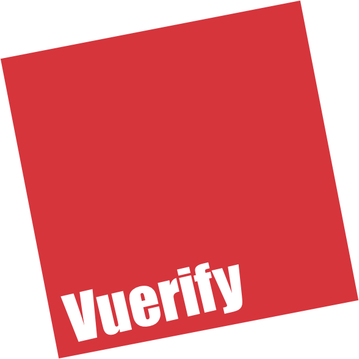

<p align="center"></p>

# Vuerify
[](https://travis-ci.org/QingWei-Li/vuerify)
[](https://www.npmjs.com/package/vuerify)
[](https://coveralls.io/github/QingWei-Li/vuerify?branch=master)


> Validation plugin for Vue.js

## Features

- Supports both Vue 1.x and 2.0
- Compact
- Simple

## Demo
- [basic](https://qingwei-li.github.io/vuerify/signup)
- [directive](https://qingwei-li.github.io/vuerify/directive)
- [directive for Vue2.0](https://qingwei-li.github.io/vuerify/directive-next)
- [mint-ui](https://qingwei-li.github.io/vuerify/mint-ui)

## Docs
- [中文文档](https://github.com/QingWei-Li/vuerify/wiki/%E5%B8%AE%E5%8A%A9%E6%96%87%E6%A1%A3)

## Installation
```shell
npm i vuerify -S
```

install directive
```shell
# Vue 1.x
npm i v-vuerify -S

# Vue 2.x
npm i v-vuerify-next -S
```

## Usage
```javascript
import Vue from 'vue'
import Vuerify from 'vuerify'

Vue.use(Vuerify /*, add rules */)
```

component
```javascript
{
  template: `
    <form @submit.prevent="handleSubmit">
      <input type="text" v-model="username">
      <input type="password" v-model="password">
      <input type="password" v-model="conform">
      <input type="submit">
      <ul><li v-for="err in errors" v-text="err"></li></ul>
    </form>
  `,
  data () {
    return {
      username: '',
      password: '',
      conform: ''
    }
  },

  vuerify: {
    username: 'required',
    password: {
      test: /\w{4,}/,
      message: '至少四位字符'
    },
    conform: {
      test (val) {
        return val === this.password
      },
      message: '密码输入不一致'
    }
  },

  computed: {
    errors () {
      return this.$vuerify.$errors
    }
  },

  methods: {
    handleSubmit () {
      if (this.$vuerify.check()) {
        // do sth
      }
    }
  }
}
```

## Development
```shell
npm install
npm run dev
```

## TODO
- English Documentation

## License
WTFPL
